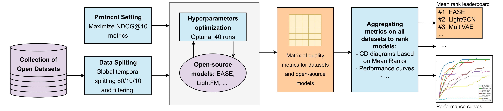

# Advancing RecSys Benchmarking Practices
**Authors:** Anonym



This repository implements the methodology presented in the article **From Variability to Stability: Advancing RecSys Benchmarking Practices** (*In progress*).

Code allows you to run different algorithms with a preset of $30$ datasets from a variety of domains.

Repository supports a lot of different RecSys libraries with different models. A full list will be provided later, but we also support the implementation of the new models. Each model can be optimized via the Optuna framework.

To get the leaderboard, we implemented all the aggregation methods mentioned in the article.

Moreover, results and pre-trained models will be saved.

All experiments and results mentioned in the article can be reproduced in the `/notebooks` directory.

## Abstract

In the rapidly evolving domain of Recommender Systems (RecSys), new algorithms frequently claim state-of-the-art performance based on evaluations over a limited set of arbitrarily selected datasets. However, this approach may fail to holistically reflect their effectiveness due to the significant impact of dataset characteristics on algorithm performance. Addressing this deficiency, this paper introduces a novel benchmarking methodology to facilitate a fair and robust comparison of RecSys algorithms, thereby advancing evaluation practices. By utilizing a diverse set of $30$ open datasets, including two introduced in this work, and evaluating $11$ collaborative filtering algorithms across $9$ metrics, we critically examine the influence of dataset characteristics on algorithm performance. We further investigate the feasibility of aggregating outcomes from multiple datasets into a unified ranking. Through rigorous experimental analysis, we validate the reliability of our methodology under the variability of datasets, offering a benchmarking strategy that balances quality and computational demands. This methodology enables a fair yet effective means of evaluating RecSys algorithms, providing valuable guidance for future research endeavors.

## Prerequirements

As some libraries have compatibility issues, we strongly recommend to use a docker image. You can follow next steps to ensure the correct install:

1. Modify file `docker_scripts/credentials` with your names and forwarded port.
2. Launch the `docker_scripts/build` script. Wait for the image complete building.
3. Launch the `docker_scripts/launch_container`.
4. Now you can simply attach to the running container and launch any experiment you want.

## Run the models

To set up the parameters of your model, one should modify the YAML configuration files located in the `config` folder. Each file corresponds to a single module, such as a dataset, library, or model. You can explore these files for more details. To run fitting process, use the following command:

```
python main.py
```

Additionally, you can use [Hydra](https://hydra.cc/docs/intro/) notation to modify parameters in the console (for example, running multiple models).

## Supported models

| Library | Model | Documentation |
| ------- | ----- | ------ |
| *Our implementation* | MostPopular| |
| | Random | |
| **LightFM** | LightFM | https://making.lyst.com/lightfm/docs/home.html |
| **Implicit** | ALS | https://benfred.github.io/implicit/ |
| | BPR | |
| **RecBole**| EASE | https://www.recbole.io/|
| | ItemKNN | |
| | MultiVAE | |
| | SLIMElastic | |
| | LightGCL | |
| | LightGCN | |
| **MSRec** | SASRec | https://github.com/recommenders-team/recommenders |

## Supported aggregation methods

- Mean Ranks (MR)
- Mean Aggregations:
  - Mean Aggregation (Arithmetic mean) (MA)
  - Geometric Mean (GM)
  - Harmonic Mean (HM)
- Dolan-More Area Under Curve (DM-AUC)
- Dolan-More leave-best-out (DM LBO)
- Social Choice Theories:
  - Copeland
  - Minimax

Realization is located in `/src/compare_methods/`
