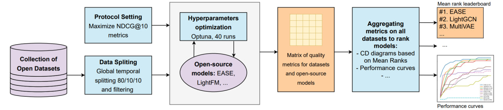
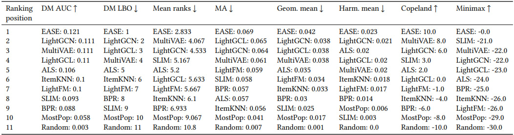
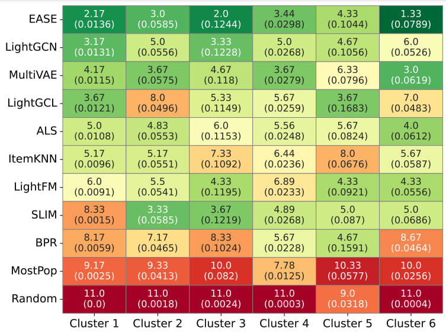

# From Variability to Stability: Advancing RecSys Benchmarking Practices

## Abstract
In the rapidly evolving domain of Recommender Systems (RecSys), new algorithms frequently claim state-of-the-art performance based on evaluations over a limited set of arbitrarily selected datasets. However, this approach may fail to holistically reflect their effectiveness due to the significant impact of dataset characteristics on algorithm performance. Addressing this deficiency, this paper introduces a novel benchmarking methodology to facilitate a fair and robust comparison of RecSys algorithms, thereby advancing evaluation practices. By utilizing a diverse set of $30$ open datasets, including two introduced in this work, and evaluating $11$ collaborative filtering algorithms across $9$ metrics, we critically examine the influence of dataset characteristics on algorithm performance. We further investigate the feasibility of aggregating outcomes from multiple datasets into a unified ranking. Through rigorous experimental analysis, we validate the reliability of our methodology under the variability of datasets, offering a benchmarking strategy that balances quality and computational demands. This methodology enables a fair yet effective means of evaluating RecSys algorithms, providing valuable guidance for future research endeavors.

## Data
Open RecSys datasets ara available [online](https://disk.yandex.ru/d/fSEBIQYZusAAuw/datasets). The datasets are presented in .parquet format. To reproduce the experiments, download datasets and put it into the `data/` directory.

Note that you can experiment with custom datasets. To do so, prepare a dataframe with interactions and weights if this one is available. The preprocessing code is located in `src/preprocessing/classic_dataset.py`.

Preprocessing examples are available in `notebooks/data_preprocessing/`.

## Environment
To reproduce the experiments from the paper, please build and run the docker container using files from `docker_scripts/`. In particular, you should:
  1) Clone this repository locally;
  2) Fill in the `credentials` file with your user ID;
  3) Run the following commands in the terminal:
     ```console
     foo@bar:~/sber-recsys/docker_scripts$ bash build
     foo@bar:~/sber-recsys/docker_scripts$ bash launch_container
     ```

## Usage
To conduct a full experiment specified in `config/config.yaml`, including model training and testing, run
```console
foo@bar:~/sber-recsys$ python main.py
```

Note that you can run the metric aggregation specified in `config/aggregation.yaml` with
```console
foo@bar:~/sber-recsys$ python aggregation.py
```

All experiments and results mentioned in the article can be reproduced in the `/notebooks` directory.

## Configs structure
We use a hydra-based experiment configuration structure. To assemble the set-up you need, you can easily adjust the `config/config.yaml`.
* `- dataset:` choose the dataset you need from the `config/dataset/` directory. Note that each dataset has unique parameters such as user column name and item column name.
* `- library:` choose the library from the `config/library/` directory for the chosen model. In the paper, there are several libraries available here: [Implicit](https://github.com/benfred/implicit), [LightFM](https://github.com/lyst/lightfm), [RecBole](https://github.com/RUCAIBox/RecBole) and [Replay](https://github.com/sberbank-ai-lab/RePlay).

There are a few parameters in `config/library/`. The config file has additional parameters if the library consists of two or more models:
* `- <library>_model:` choose the model from the `config/library/<library>_model/`.

## Supported models

| Library | Model | Documentation |
| ------- | ----- | ------ |
| *Our implementation* | MostPopular| |
| | Random | |
| **LightFM** | LightFM | https://making.lyst.com/lightfm/docs/home.html |
| **Implicit** | ALS | https://benfred.github.io/implicit/ |
| | BPR | |
| **RecBole**| EASE | https://www.recbole.io/|
| | ItemKNN | |
| | MultiVAE | |
| | SLIMElastic | |
| | LightGCL | |
| | LightGCN | |
| **MSRec** | SASRec | https://github.com/recommenders-team/recommenders |

Note that you can experiment with a custom model. To do so, you need to add the appropriate config with parameters in `config/` and add two objects:
- `src/pipeline_<library>.py`: if your custom model is from a new library, we use the runner class to unify the launch. Your custom Runner must use `BaseRunner` class and contain methods such as `['run']`. Other methods are optional.
- `src/models/<library>/model.py`: your custom model must have such functions as `['__init__', 'initialize_with_params', 'initialize_saved_model', 'initialize_with_optimization', 'objective', 'fit', 'save_model, 'recommend_k']`.

## Supported aggregation methods
Several aggregating approaches are located in `src/compare_methods/`. There are a list of methods:
- Mean Ranks (MR)
- Mean Aggregations:
  - Mean Aggregation (Arithmetic mean) (MA)
  - Geometric Mean (GM)
  - Harmonic Mean (HM)
- Dolan-More Area Under Curve (DM-AUC)
- Dolan-More leave-best-out (DM LBO)
- Social Choice Theories:
  - Copeland
  - Minimax

The examples of aggregating are located in `notebooks/results_aggregation/`.

## Results summary
We introduced a novel benchmarking system for recommendation systems. Our approach is interpretable and robust, working for distinct metrics used for RecSys evaluation. Among the considered methods, we identify EASE as a clear winner with respect to all considered aggregation strategies. Other methods show inferior performance on average while being interesting for particular subdomains identified by our clustering scheme. The key findings are highlighted here.

### The proposed benchmarking
We collect a diverse set of open-source datasets and establish a robust pipeline that incorporates predefined procedural steps. Additionally, we integrate 11 RecSys algorithms from various open-source libraries and repositories. This pipeline serves a dual purpose: it streamlines the evaluation process and enhances the comparability of results across different algorithms and datasets. The pipeline scheme is shown here.

<p align="center">
  
</p>

### The general results

Different aggregation methods yield distinct rankings for the approaches considered. We added the general results using distinct rankings approaches, as shown here.

<p align="center">
  
</p>

With the set of 30 datasets, the ranks consistently identify EASE as the top-performing approach. For the subsequent top positions, we have a pair of candidates for most aggregations: MultiVAE and LightGCN.

### Ranks using selected datasets clusters
With the clustering approach described in the paper, we obtain separate rankings and metric values for different clusters, as shown here. 

<p align="center">
  
</p>

The top approach in almost
all cases is EASE, losing only to LightGCL for Cluster 5. Other approaches exhibit less stability. For example, LightGCL has an average rank of 8 for cluster 2, while SLIM has the second-best average rank for it. Part of this variability can be explained by the complexity of clusters: the Geom. mean varies significantly from 0.0136 to 0.1244 for EASE. These results also justify the usage of datasets with similar characteristics to deploy conditions in offline evaluation for business use cases.

## Citation
If you find this repository useful, please feel free to star it and cite our paper.

Need help? Contact me via [Telegram](https://t.me/Escape142).
